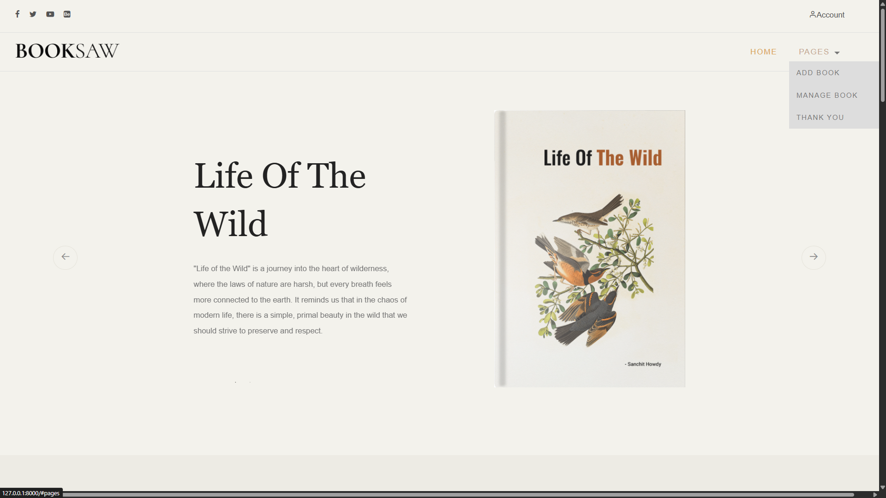

# 📚 Book Rating & Review System - Django Web App

Welcome to the **Book Rating and Review System**, a Django-based web application where users can browse books, rate them, and leave reviews. This project is perfect for learning Django fundamentals while building a practical, database-driven app.

 

---

## 🚀 Features

- 🔐 User Registration and Login
- 📚 Add, View, and Manage Books
- 🌟 Leave Ratings and Reviews
- 🧮 Average Rating Calculation
- 📝 Simple and clean UI with dynamic content
- 📊 Admin Panel for managing books and users

## 🛠️ Technologies Used

- **Python 3.10+**
- **Django 4.x**
- **SQLite3** (default DB)
- **HTML/CSS** (Bootstrap optional for UI)
- **Virtual Environment (venv)** for dependency isolation

## 🖼️ Screenshots

### Home Page


### Show More
>[More Screenshots...](https://github.com/SonaniAkshit/Bookstore-JspServlet/tree/main/BookStore/web/images/screenshots/README.md)


## ⚙️ Setup Instructions

Follow these steps to run the project on your local machine:

### 1. Clone the Repository

```bash
git clone https://github.com/SonaniAkshit/Books-Rating-Review-Python-Django.git
cd Books-Rating-Review-Python-Django/Book_Rating_And_Review
```
### 2. Set Up a Virtual Environment
```bash
# Create a virtual environment
python -m venv venv

# Activate the virtual environment
# For Windows:
venv\Scripts\activate

# For macOS/Linux:
source venv/bin/activate
```
### 3. Install Dependencies
```bash
pip install -r requirements.txt
```
- If requirements.txt is not present, install Django manually:
```bash
pip install django
```
### 4. Apply Migrations
```bash
python manage.py makemigrations
python manage.py migrate
```
### 5. Create a Superuser (Admin)
```bash
python manage.py createsuperuser
```
- Follow the prompts to create your admin credentials.

### 6. Run the Development Server
```bash
python manage.py runserver
```
### Open your browser and go to:
- http://127.0.0.1:8000/ to view the app
- http://127.0.0.1:8000/admin/ to access the admin panel

## 📂 Project Structure
```bash
Book_Rating_And_Review/
├── books/                # Main app
│   ├── migrations/
│   ├── templates/
│   └── views.py
├── Book_Rating_And_Review/
│   └── settings.py
├── manage.py
└── db.sqlite3
```
